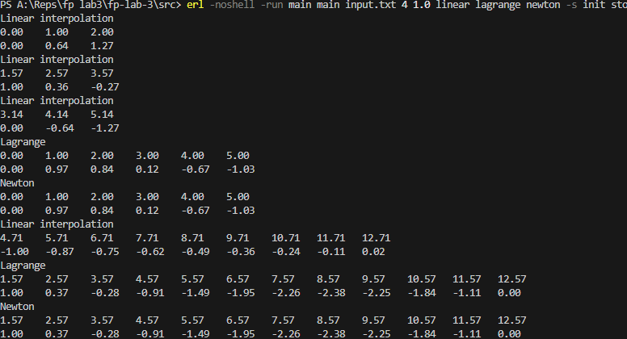

# Лабораторная работа №3 Голощапов Иван

Цель: получить навыки работы с вводом/выводом, потоковой обработкой данных, командной строкой.

В рамках лабораторной работы вам предлагается повторно реализовать лабораторную работу по предмету "Вычислительная математика" посвящённую аппроксимации (в разные годы это лабораторная работа 3 или 4) со следующими дополнениями:

- обязательно должна быть реализована линейная интерполяция (отрезками, [link](https://en.wikipedia.org/wiki/Linear_interpolation));
- настройки алгоритма аппроксимирования и выводимых данных должны задаваться через аргументы командной строки:
   - какие алгоритмы использовать (в том числе два сразу);
   - частота дискретизации результирующих данных;
   - и т.п.;
- входные данные должны задаваться в текстовом формате на подобии ".csv" (к примеру `x;y\n` или `x\ty\n`) и подаваться на стандартный ввод, входные данные должны быть отсортированы по возрастанию x;
- выходные данные должны подаваться на стандартный вывод;
- программа должна работать в потоковом режиме (пример -- `cat | grep 11`), это значит, что при запуске программы она должна ожидать получения данных на стандартный ввод, и, по мере получения достаточного количества данных, должна выводить рассчитанные точки в стандартный вывод;

Приложение должно быть организовано следующим образом:

```text
    +---------------------------+
    | обработка входного потока |
    +---------------------------+
            |
            | поток / список / последовательность точек
            v
    +------------------------+      +------------------------------+
    | алгоритм аппроксимации |<-----| генератор точек, для которых |
    +------------------------+      | необходимо вычислить         |
            |                       | аппроксимированное значение   |
            |                       +------------------------------+
            |
            | поток / список / последовательность рассчитанных точек
            v
    +------------------------+
    | печать выходных данных |
    +------------------------+
```

Потоковый режим для алгоритмов, работающих с группой точек должен работать следующим образом:

```text
o o o o o o . . x x x
  x x x . . o . . x x x
    x x x . . o . . x x x
      x x x . . o . . x x x
        x x x . . o . . x x x
          x x x . . o . . x x x
            x x x . . o o o o o o EOF
```

где:

- каждая строка -- окно данных, на основании которых производится расчёт алгоритма;
- строки сменяются по мере поступления в систему новых данных (старые данные удаляются из окна, новые -- добавляются);
- `o` -- рассчитанные данные, можно видеть:
   - большинство окон используется для расчёта всего одной точки, так как именно в "центре аппроксимации" результат наиболее точен;
   - первое и последнее окно используются для расчёта большого количества точек, так лучших данных для расчёта у нас не будет.
- `x` -- точки, расчёт которых для "окон" не требуется.

Общие требования:

- программа должна быть реализована в функциональном стиле;
- ввод/вывод должен быть отделён от алгоритмов аппроксимации;
- требуется использовать идиоматичный для технологии стиль программирования.

Содержание отчёта:

- титульный лист;
- требования к разработанному ПО, включая описание алгоритма;
- ключевые элементы реализации с минимальными комментариями;
- ввод/вывод программы;
- выводы (отзыв об использованных приёмах программирования).

Общие рекомендации по реализации. Не стоит писать большие и страшные автоматы, управляющие поведением приложения в целом. Если у вас:

- Язык с ленью -- используйте лень.
- Языки с параллельным программированием и акторами -- используйте их.
- Язык без всей этой прелести -- используйте генераторы/итераторы/и т.п.


---

## Выполнение

Запуск в командной строке

erl -noshell -run main main stdio 4 1.0 linear lagrange newton -s init stop

Запуск с использованием файла

erl -noshell -run main main input.txt 4 1.0 linear lagrange newton -s init stop


В [основной файле](src/main.erl) мы считываем аргументы командной строки и запускаем потоки на обработку ввода вывода и матиматики.

В [файле ввода вывода](src/io_methods.erl) написана логика приёма значений с файла или консоли, и отправка полученных значений.

В [файле математики](src/math_methods.erl) описаны методы подсчёта интерполяции.

В [файле тестов](test/math_test.erl) описаны тесты математических функций

## Выводы

- В ходе выполонения работы было создано модульное приложение, производящее интерполяцию по данным, принимаемым из потока ввода.
- Разделение на модули позволило исполнять различные части в разных процессах, обменивающихся сообщениями.
